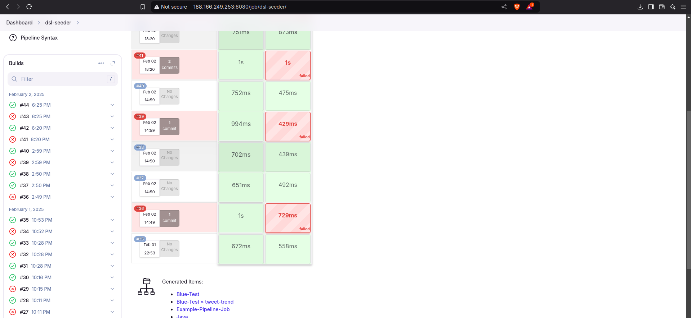
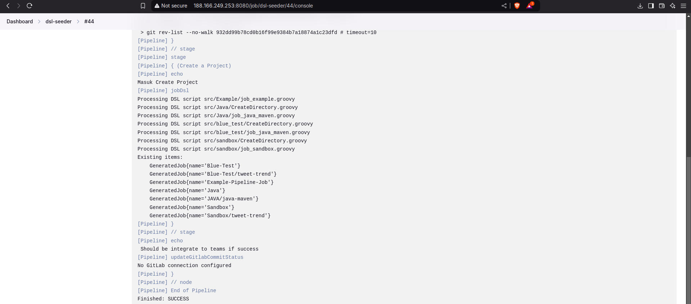
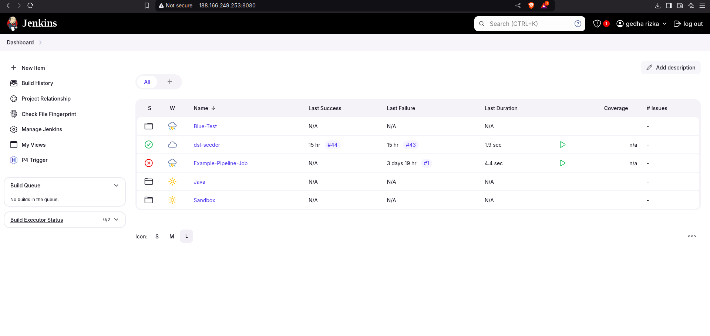
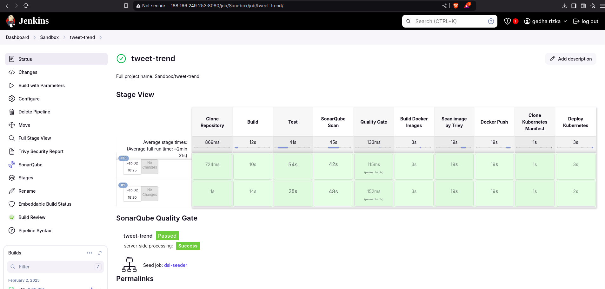

# CICD Jenkins

### Jenkins Crete job by DSL



``` bash
stage('Create a Project') {
      echo "Masuk Create Project"
      jobDsl targets: [  
        'src/Example/job_example.groovy',
        'src/Java/*',
        'src/blue_test/*',
        'src/sandbox/*',
      ].join('\n'),
      removedJobAction: 'DELETE',
      removedViewAction: 'DELETE',
      lookupStrategy: 'SEED_JOB'
      failFast: true|false
    }
```


### Result Job DSL



### CICD with Jenkins



**====> Steps <====**

**1. Clone Repository** 

```bash 
git([url: '[GIT_URL]', branch: [BRANCH]])
```

**2. Maven build:** 
```bash 
mvn clean deploy -Dmaven.test.skip=true
```

**3. Maven Test:** 
```bash 
mvn surefire-report:report
```

**4. Sonarqube Scan:** 
```bash 
withSonarQubeEnv('sonar-docker-server'){
                    withCredentials([string(credentialsId:'sonar-token',variable:'SONAR_TOKEN')]){
                        sh """
                            mvn clean verify sonar:sonar \
                            -Dsonar.projectKey=tweet-trend \
                            -Dsonar.projectName=tweet-trend \
                            -Dsonar.host.url=http://${SONAR_SERVER}:${SONAR_PORT} \
                            -Dsonar.login=${SONAR_TOKEN}
                        """
                    }
                }
```

**5. Quality Gate Sonarqube:** 
```bash 
timeout(time: 5, unit: 'MINUTES') { // Just in case something goes wrong, pipeline will be killed after a timeout
                    def qg = waitForQualityGate() // Reuse taskId previously collected by withSonarQubeEnv
                    if (qg.status != 'OK') {
                        error "Pipeline aborted due to quality gate failure: ${qg.status}"
                    }   
                }
```

**6. Docker Build Image:** 
```bash 
docker build -t gedharizka/'''+repository_name+''':latest .
```

**7. Scan image by trivy:** 
```bash 
trivy image --format template --template "@/usr/local/share/trivy/templates/html.tpl" -o trivy-report.html gedharizka/'''+repository_name+''':latest

```

**8. Upload Image** 
```bash 
docker login -u ${DOCKER_HUB_USERNAME} -p ${DOCKER_HUB_PASSWORD}
docker push gedharizka/'''+repository_name+''':latest
```

**9. Clone Manifest** 
```bash 
git([url: '[GIT_URL]', branch: [BRANCH]])
```

**10. Apply Manifest** 
```bash 
kubectl apply -f deployment.yaml -n demo 
kubectl apply -f service.yaml -n demo 
kubectl apply -f ingress.yaml -n demo 
kubectl get pods -n demo -o wide 
```

